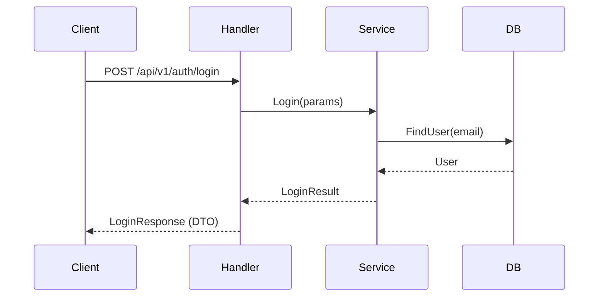

# PR Description Template

This is the standard template for all PR descriptions generated by git-craft.
Every section must be present. If a section is not applicable, write "ไม่มี" instead of removing it.
All narrative text is written in Thai. Technical terms (function names, file paths, API endpoints, etc.) remain in English.

---

## AI Prompt Schema Reference

All `🤖 Prompt for AI Agents` blocks in this template MUST follow the structured schema below.
This ensures AI agents can parse, understand context, and execute with maximum accuracy and coverage.

### Base Schema (ใช้ทุก AI Prompt)

Every AI prompt must contain these base fields:

```
- **Target:** `path/to/file.go` → `func FunctionName()` (lines X-Y)
- **Action:** [refactor | add-test | fix-security | optimize | add-validation | add-error-handling]
- **Context:** [อธิบายว่า code ส่วนนี้ทำอะไร ในบริบทของ business logic + ทำไมถึงต้องเปลี่ยน]
- **Dependencies:** [files/functions/interfaces ที่เกี่ยวข้อง ที่ AI ต้องรู้เพื่อทำงานได้ถูกต้อง]
```

### Execution Protocol (ใช้ทุก AI Prompt)

Every AI prompt must include this execution protocol to ensure safe, verified execution:

```
**── Execution Protocol ──**
1. Read target file → verify finding ยังคงอยู่ใน current code
2. ถ้ายืนยันแล้ว → implement fix/change
3. ถ้าไม่เจอแล้ว (code เปลี่ยนไปแล้ว) → skip พร้อมอธิบายเหตุผล
4. Run `task format` หลังแก้ไข
5. ตรวจสอบว่า existing functionality ไม่พัง
```

### Validation Checklist (ใช้ทุก AI Prompt)

Every AI prompt must end with a validation checklist — the definition of done that AI can self-verify:

```
**── Validation Checklist ──**
- [ ] [specific verifiable condition 1]
- [ ] [specific verifiable condition 2]
- [ ] [specific verifiable condition 3]
```

### Domain Extensions

In addition to the base schema, each domain adds specialized fields:

**Improvement Extension:**
```
**── Improvement Extension ──**
- **ImprovementType:** [refactor | performance | maintainability | observability | error-handling]
- **CurrentBehavior:** [พฤติกรรมปัจจุบันที่เป็นปัญหา]
- **DesiredBehavior:** [พฤติกรรมที่ต้องการหลังแก้ไข]
```

**Security Extension:**
```
**── Security Extension ──**
- **VulnerabilityType:** [OWASP category เช่น A01:Broken Access Control, A03:Injection]
- **AttackVector:** [วิธีโจมตีที่เป็นไปได้ อธิบายเป็น concrete steps]
- **Severity:** 🔴 Critical | 🟠 High | 🟡 Medium
- **Remediation:** [แนวทางแก้ไขที่แนะนำ พร้อมระบุ pkg/function ที่ควรใช้]
```

**Test Extension:**
```
**── Test Extension ──**
- **TestType:** [unit | integration | e2e]
- **Framework:** [testing + testify/suite + testify/mock]
- **Scenarios:**
  - ✅ Happy: [description → expected result]
  - ❌ Error: [description → expected error]
  - 🔲 Edge: [description → expected behavior]
- **Mocking:**
  ```go
  // concrete mock setup code ที่ AI สามารถ copy ไปใช้ได้เลย
  ```
- **Assertions:**
  ```go
  // concrete assertion code ที่แสดง expected output ชัดเจน
  ```
```

### Extractable Metadata (Optional)

For future automation (ticket extraction, batch processing), AI Prompts MAY include HTML comment metadata:

```html
<!-- AI-PROMPT-ID: [DOMAIN]-[NNN] -->
<!-- AI-PROMPT-TYPE: improvement | security | test -->
<!-- AI-PROMPT-PRIORITY: critical | high | medium | low -->
```

These HTML comments are invisible on GitHub but parseable by scripts for automated task extraction.

---

## Template

```markdown
## 📋 สรุปภาพรวม (Summary)

<!-- 2-3 ประโยคสรุปสิ่งที่ PR นี้ทำทั้งหมด ให้คนอ่านเข้าใจได้ทันทีโดยไม่ต้องดู code -->

## 🔗 ความเป็นมา (Background)

<!-- อธิบายบริบทเบื้องหลังว่าเกิดอะไรขึ้นก่อนหน้านี้ ทำไมถึงต้องมี PR นี้
     อาจอ้างอิง issue, ticket, หรือ discussion ที่เกี่ยวข้อง -->

## 🎯 วัตถุประสงค์ (Objective)

<!-- ระบุเป้าหมายหลักของ PR นี้อย่างชัดเจน -->

## 💡 ทำไปทำไม (Motivation)

<!-- อธิบายเหตุผลเชิงลึกว่าทำไมถึงต้องทำสิ่งนี้ ปัญหาอะไรที่ต้องการแก้ -->

## 🎯 ทำไปเพื่ออะไร (Purpose & Value)

<!-- อธิบายคุณค่าที่ได้รับจากการเปลี่ยนแปลงนี้ ส่งผลดีต่อระบบหรือทีมอย่างไร -->

## ⚠️ ถ้าไม่ทำจะเป็นยังไง (Risk of Not Doing)

<!-- อธิบายความเสี่ยงหรือผลกระทบที่จะเกิดขึ้นหากไม่ทำการเปลี่ยนแปลงนี้ -->

## 📝 รายละเอียดการเปลี่ยนแปลง (Changes Detail)

<!-- รายละเอียดสิ่งที่เปลี่ยนแปลงในเชิง technical
     จัดกลุ่มตาม module หรือ feature area -->

### ไฟล์ที่เปลี่ยนแปลง (Files Changed)

| ไฟล์ | ประเภทการเปลี่ยนแปลง | รายละเอียด |
|------|----------------------|-----------|
| `path/to/file` | Added/Modified/Deleted | คำอธิบายสั้นๆ |

## 📊 Diagrams

<!-- Mermaid diagrams ที่ช่วยให้ reviewer เข้าใจ changes ได้เร็วขึ้น
     วิเคราะห์จาก code changes แล้วเลือก diagram types ที่เหมาะสม (1-3 diagrams):

     - Flowchart: business logic ใหม่, decision flows, error handling paths
     - Sequence Diagram: การสื่อสารระหว่าง components, API call chains, auth flows
     - User Journey: user-facing feature ใหม่, UX flow changes
     - Mindmap: changes กระจายหลาย modules — ช่วย overview ภาพรวม
     - Architecture Diagram: structural changes, new modules, dependency changes

     ไม่จำเป็นต้องใส่ทุก type — เลือกเฉพาะที่เพิ่มคุณค่าให้ reviewer
     ถ้า changes เป็นแค่ config/docs/style → เขียน "ไม่มี" -->

<!-- ตัวอย่าง format:

### 🔄 Sequence Diagram — Auth Login Flow

แสดงลำดับ request/response ของ login flow ที่เปลี่ยนแปลง



-->

## 💥 ผลกระทบ (Impact Analysis)

<!-- วิเคราะห์ว่าการเปลี่ยนแปลงนี้กระทบส่วนไหนของระบบบ้าง
     ทั้ง direct impact และ indirect impact -->

## ⚡ Breaking Changes

<!-- ระบุการเปลี่ยนแปลงที่อาจทำให้ระบบเดิมทำงานผิดพลาด
     เช่น API signature เปลี่ยน, database schema เปลี่ยน, config format เปลี่ยน
     ถ้าไม่มี ให้เขียน "ไม่มี" -->

## 🧪 วิธีการทดสอบ (How to Test)

<!-- ขั้นตอนที่ reviewer สามารถใช้ทดสอบ PR นี้ได้
     อาจรวมถึง commands ที่ต้องรัน, endpoints ที่ต้องยิง, หรือ scenarios ที่ต้องทดสอบ -->

## 🧪 ผลการทดสอบ (Testing Results)

<!-- ผลจากการรัน automated tests ในโปรเจกต์ ถ้ามี test files ที่เปลี่ยนแปลงหรือเพิ่มใหม่
     จะแสดงผลลัพธ์ที่ได้จากการรัน test จริง
     ถ้าไม่มี test files ให้ระบุว่า "ยังไม่มี automated test สำหรับการเปลี่ยนแปลงนี้"
     พร้อมแนะนำว่าควรเพิ่ม test อะไรบ้าง -->

### Test Files ที่เปลี่ยนแปลง

| ไฟล์                | สถานะ          | รายละเอียด    |
|---------------------|----------------|---------------|
| `path/to/test_file` | Added/Modified | คำอธิบายสั้นๆ |

### ผลการรัน Test

```
<!-- วางผลลัพธ์จากการรัน test ที่นี่ -->
```

**สถานะ:** ✅ PASS / ❌ FAIL / ⚠️ ไม่สามารถรันได้ / 📝 ยังไม่มี test

### Test Coverage แนะนำเพิ่มเติม

<!-- ถ้า SKILL ตรวจพบว่ามี source files ที่เปลี่ยนแปลงแต่ไม่มี test ครอบคลุม ให้แนะนำที่นี่ -->

## 📸 Screenshots / Evidence

<!-- ใส่ screenshot ที่แสดงให้เห็นผลลัพธ์ของการเปลี่ยนแปลง เช่น:
     - UI ที่เปลี่ยนไป (before/after)
     - API response ตัวอย่าง
     - Terminal output ที่สำคัญ
     - Performance metrics

     Format:
     

     ถ้ายังไม่มี screenshot ให้ใส่ placeholder:
     > 📸 **TODO:** เพิ่ม screenshot แสดง [สิ่งที่ควรจะ capture] -->

<!-- ถ้าไม่มี ให้เขียน "ไม่มี" -->

## 💡 Improvement Suggestions

<!-- คำแนะนำจาก SKILL ว่า ถ้าจะทำให้ code ใน PR นี้ดีขึ้นไปอีก ควรพิจารณาอะไรบ้าง
     เป็นเพียงข้อเสนอแนะ ไม่ได้บังคับให้ทำใน PR นี้ อาจเป็น follow-up ticket ได้

     วิเคราะห์จาก code changes แล้วแนะนำในมิติต่างๆ เช่น:
     - Code Quality: refactoring, naming, pattern improvements
     - Performance: caching, query optimization, lazy loading
     - Scalability: horizontal scaling readiness, bottleneck prevention
     - Maintainability: documentation, error handling, logging
     - Observability: metrics, tracing, alerting
     - Developer Experience: tooling, automation, CI/CD -->

### ระดับ: ควรทำ (Should Do)
<!-- สิ่งที่แนะนำอย่างยิ่ง เพราะจะช่วยลดปัญหาในอนาคต
     แต่ละ item ต้องมี details block "Prompt for AI Agents" ตาม Structured AI Prompt Schema
     ใช้ Base Schema + Improvement Extension + Execution Protocol + Validation Checklist

     ตัวอย่าง format:

     <!-- AI-PROMPT-ID: IMP-001 -->
     <!-- AI-PROMPT-TYPE: improvement -->
     <!-- AI-PROMPT-PRIORITY: high -->
     1. **[ชื่อ suggestion]**
        - ไฟล์: `path/to/file.go`
        - เหตุผล: อธิบายว่าทำไมถึงควรทำ

        <details>
        <summary>🤖 Prompt for AI Agents</summary>

        **── Base ──**
        - **Target:** `path/to/file.go` → `func FunctionName()` (lines X-Y)
        - **Action:** refactor
        - **Context:** อธิบายว่า function นี้ทำอะไร ในบริบท business logic อะไร
          ปัจจุบันมีปัญหาอะไร ทำไมต้องเปลี่ยน
        - **Dependencies:** ระบุ files/functions/interfaces ที่เกี่ยวข้อง

        **── Improvement Extension ──**
        - **ImprovementType:** refactor | performance | maintainability | observability
        - **CurrentBehavior:** พฤติกรรมปัจจุบันที่เป็นปัญหา
        - **DesiredBehavior:** พฤติกรรมที่ต้องการหลังแก้ไข

        **── Execution Protocol ──**
        1. Read target file → verify finding ยังคงอยู่ใน current code
        2. ถ้ายืนยันแล้ว → implement fix/change
        3. ถ้าไม่เจอแล้ว (code เปลี่ยนไปแล้ว) → skip พร้อมอธิบายเหตุผล
        4. Run `task format` หลังแก้ไข
        5. ตรวจสอบว่า existing functionality ไม่พัง

        **── Validation Checklist ──**
        - [ ] [specific verifiable condition 1]
        - [ ] [specific verifiable condition 2]
        - [ ] ไม่กระทบ existing functionality

        </details>

-->

### ระดับ: น่าทำ (Nice to Have)
<!-- สิ่งที่จะทำให้ดีขึ้น แต่ไม่เร่งด่วน
     แต่ละ item ต้องมี details block "Prompt for AI Agents" ตาม Structured AI Prompt Schema
     ใช้ Base Schema + Improvement Extension + Execution Protocol + Validation Checklist
     format เหมือน section ควรทำ

     ตัวอย่าง format:

     <!-- AI-PROMPT-ID: IMP-002 -->
     <!-- AI-PROMPT-TYPE: improvement -->
     <!-- AI-PROMPT-PRIORITY: medium -->
     1. **[ชื่อ suggestion]**
        - ไฟล์: `path/to/file.go`
        - เหตุผล: อธิบายว่าทำไมถึงน่าทำ

        <details>
        <summary>🤖 Prompt for AI Agents</summary>

        **── Base ──**
        - **Target:** `path/to/file.go` → `func FunctionName()` (lines X-Y)
        - **Action:** refactor
        - **Context:** อธิบาย context ของ code ส่วนนี้
        - **Dependencies:** ระบุ dependencies

        **── Improvement Extension ──**
        - **ImprovementType:** [type]
        - **CurrentBehavior:** [current]
        - **DesiredBehavior:** [desired]

        **── Execution Protocol ──**
        1. Read target file → verify finding ยังคงอยู่ใน current code
        2. ถ้ายืนยันแล้ว → implement fix/change
        3. ถ้าไม่เจอแล้ว (code เปลี่ยนไปแล้ว) → skip พร้อมอธิบายเหตุผล
        4. Run `task format` หลังแก้ไข
        5. ตรวจสอบว่า existing functionality ไม่พัง

        **── Validation Checklist ──**
        - [ ] [specific verifiable condition 1]
        - [ ] [specific verifiable condition 2]
        - [ ] ไม่กระทบ existing functionality

        </details>

-->

## 🔐 Penetration Testing Suggestions

<!-- คำแนะนำด้าน security testing จาก SKILL
     วิเคราะห์จาก code changes ว่ามี attack surface อะไรบ้างที่ควรทดสอบ
     เป็นเพียงข้อเสนอแนะเพื่อให้ทีมพิจารณา ไม่ใช่ผล pentest จริง

     ครอบคลุมมิติเหล่านี้ตามความเหมาะสม:
     - Authentication & Authorization: token spoofing, privilege escalation
     - Input Validation: SQL injection, XSS, command injection
     - API Security: rate limiting, CORS, parameter tampering
     - Data Exposure: sensitive data in logs/responses, error information leakage
     - Business Logic: race conditions, IDOR, workflow bypass
     - Infrastructure: dependency vulnerabilities, misconfigurations -->

### 🎯 Attack Surfaces ที่ควรทดสอบ

| จุดที่ควรทดสอบ             | ประเภทความเสี่ยง         | ระดับความสำคัญ | วิธีทดสอบเบื้องต้น |
|----------------------------|--------------------------|----------------|--------------------|
| ตัวอย่าง endpoint/function | ประเภท (e.g., Injection) | 🔴/🟠/🟡       | วิธีทดสอบสั้นๆ     |

<!-- แต่ละ attack surface ที่สำคัญ (🔴/🟠) ควรมี Prompt for AI Agents
     ตาม Structured AI Prompt Schema ใช้ Base Schema + Security Extension + Execution Protocol + Validation Checklist

     ตัวอย่าง format:

     <!-- AI-PROMPT-ID: SEC-001 -->
     <!-- AI-PROMPT-TYPE: security -->
     <!-- AI-PROMPT-PRIORITY: critical -->
     #### 🔴 [Attack Surface Name] — `path/to/file.go`

     <details>
     <summary>🤖 Prompt for AI Agents</summary>

     **── Base ──**
     - **Target:** `path/to/file.go` → `func HandlerName()` (lines X-Y)
     - **Action:** fix-security
     - **Context:** อธิบายว่า endpoint/function นี้ทำอะไร
       ปัจจุบันมีช่องโหว่อะไร ในสถานการณ์ไหน
     - **Dependencies:** ระบุ middleware, validators, packages ที่เกี่ยวข้อง

     **── Security Extension ──**
     - **VulnerabilityType:** [OWASP category เช่น A01:Broken Access Control]
     - **AttackVector:** [อธิบาย concrete steps ที่ attacker ใช้โจมตีได้]
     - **Severity:** 🔴 Critical | 🟠 High | 🟡 Medium
     - **Remediation:** [แนวทางแก้ไข พร้อมระบุ pkg/function ที่ควรใช้]

     **── Execution Protocol ──**
     1. Read target file → verify vulnerability ยังคงอยู่ใน current code
     2. ถ้ายืนยันแล้ว → implement security fix
     3. ถ้าไม่เจอแล้ว (code เปลี่ยนไปแล้ว) → skip พร้อมอธิบายเหตุผล
     4. Run `task format` หลังแก้ไข
     5. ตรวจสอบว่า existing functionality ไม่พัง

     **── Validation Checklist ──**
     - [ ] [ช่องโหว่ถูกปิดแล้ว — ระบุวิธีตรวจสอบ]
     - [ ] [attack vector ไม่สามารถใช้ได้อีก]
     - [ ] ไม่กระทบ happy path ของ feature

     </details>

-->

### 📝 Security Recommendations
<!-- ข้อแนะนำเพิ่มเติมด้าน security ที่ไม่ได้อยู่ในตาราง
     แต่ละ item ต้องมี details block "Prompt for AI Agents" ตาม Structured AI Prompt Schema
     ใช้ Base Schema + Security Extension + Execution Protocol + Validation Checklist

     ตัวอย่าง format:

     <!-- AI-PROMPT-ID: SEC-002 -->
     <!-- AI-PROMPT-TYPE: security -->
     <!-- AI-PROMPT-PRIORITY: high -->
     1. **[ชื่อ recommendation]**
        - ไฟล์: `path/to/file.go`
        - ความเสี่ยง: อธิบายความเสี่ยงที่อาจเกิดขึ้น

        <details>
        <summary>🤖 Prompt for AI Agents</summary>

        **── Base ──**
        - **Target:** `path/to/file.go` → `func FunctionName()` (lines X-Y)
        - **Action:** fix-security
        - **Context:** อธิบาย context และความเสี่ยงของ code ส่วนนี้
        - **Dependencies:** ระบุ dependencies

        **── Security Extension ──**
        - **VulnerabilityType:** [OWASP category]
        - **AttackVector:** [concrete attack steps]
        - **Severity:** 🔴/🟠/🟡
        - **Remediation:** [วิธีแก้ไข]

        **── Execution Protocol ──**
        1. Read target file → verify vulnerability ยังคงอยู่ใน current code
        2. ถ้ายืนยันแล้ว → implement security fix
        3. ถ้าไม่เจอแล้ว (code เปลี่ยนไปแล้ว) → skip พร้อมอธิบายเหตุผล
        4. Run `task format` หลังแก้ไข
        5. ตรวจสอบว่า existing functionality ไม่พัง

        **── Validation Checklist ──**
        - [ ] [verifiable security condition 1]
        - [ ] [verifiable security condition 2]
        - [ ] ไม่กระทบ existing functionality

        </details>

-->

## 🧪 Test Case Scenario Suggestions

<!-- คำแนะนำ test case สำหรับ QA/Tester ที่จะเข้ามาทดสอบ PR นี้
     วิเคราะห์จาก code changes จริงว่ามี scenario อะไรบ้างที่ควรทดสอบเพื่อให้ได้ coverage สูงสุด
     เรียงตาม priority — ถ้ามีเวลาจำกัด ควร test High Priority ก่อน

     **สำคัญ:** ทุก test case ต้องมี <details> block "🤖 Auto-generate Unit Test"
     ที่ AI agent สามารถ copy ไปสร้าง automated test ได้ทันที
     ใช้ Base Schema + Test Extension + Execution Protocol + Validation Checklist -->

### 🎯 High Priority Test Cases

<!-- test cases หลักที่ต้องรันก่อน: happy path ของ feature ใหม่, critical business logic

     ตัวอย่าง format:

     <!-- AI-PROMPT-ID: TEST-001 -->
     <!-- AI-PROMPT-TYPE: test -->
     <!-- AI-PROMPT-PRIORITY: critical -->
     | # | Test Scenario | ประเภท | Priority |
     |---|--------------|--------|----------|
     | 1 | Login ด้วย email/password ถูกต้อง ได้รับ JWT | Functional | 🔴 |

     **Steps:** POST `/api/v1/auth/login` ด้วย `{"email":"test@example.com","password":"valid"}`
     **Expected:** 200 OK + body มี `access_token` และ `refresh_token`

     <details>
     <summary>🤖 Auto-generate Unit Test</summary>

     **── Base ──**
     - **Target:** `internal/authentication/auth/auth_service.go` → `func (s *service) Login()` (lines 34-56)
     - **Action:** add-test
     - **Context:** ฟังก์ชัน Login รับ LoginParams{Email,Password} → query user จาก DB
       → verify bcrypt hash → generate JWT pair → return LoginResult
       เป็น core authentication flow ของระบบ
     - **Dependencies:**
       - `repository.UserRepository` — interface สำหรับ query user (FindByEmail)
       - `pkg/jwt` — GenerateTokenPair สร้าง access + refresh tokens
       - `pkg/password` — Verify เทียบ plain text กับ bcrypt hash
       - `internal/authentication/auth/auth_model.go` — LoginParams, LoginResult structs

     **── Test Extension ──**
     - **TestType:** unit
     - **Framework:** testing + testify/suite + testify/mock
     - **Scenarios:**
       - ✅ Happy: valid email + correct password → return LoginResult{AccessToken, RefreshToken} + nil error
       - ❌ Error: email not found in DB → return nil + `ErrNotFound`
       - ❌ Error: wrong password (bcrypt mismatch) → return nil + `ErrInvalidCredentials`
       - 🔲 Edge: empty email string → return nil + `ErrValidation`
       - 🔲 Edge: user status = "disabled" → return nil + `ErrForbidden`
     - **Mocking:**
       ```go
       repo := new(mocks.UserRepository)
       repo.On("FindByEmail", mock.Anything, "test@example.com").
           Return(&entity.User{
               ID: 1, Email: "test@example.com",
               PasswordHash: hashedPassword, Status: "active",
           }, nil)
       ```
     - **Assertions:**
       ```go
       assert.NotEmpty(t, result.AccessToken)
       assert.NotEmpty(t, result.RefreshToken)
       assert.NoError(t, err)
       ```

     **── Execution Protocol ──**
     1. Read target file → เข้าใจ function signature + all dependencies
     2. สร้าง test file ที่ `internal/authentication/auth/auth_service_test.go`
     3. Implement ทุก scenario ใน Scenarios list
     4. Run `task format`
     5. Run `go test ./internal/authentication/auth/... -v` → verify all pass

     **── Validation Checklist ──**
     - [ ] ทุก scenario ใน Scenarios list มี test function ครอบคลุม
     - [ ] Mock setup ถูกต้อง — ทุก dependency ถูก mock
     - [ ] Assertions ตรวจสอบทั้ง return value และ error type
     - [ ] Test file compile ได้ และ pass ทุก case
     - [ ] ไม่มี test ที่ depend on external service (DB, API)

     </details>

-->

### 🔄 Regression Test Cases

<!-- features เดิมที่อาจได้รับผลกระทบจาก PR นี้ ต้อง test ซ้ำเพื่อให้แน่ใจว่ายังทำงานปกติ
     ดูจาก Impact Analysis ว่ากระทบอะไรบ้าง แล้วสร้าง regression cases

     ทุก regression case ต้องมี <details> block "🤖 Auto-generate Unit Test"
     ตาม format เดียวกับ High Priority Test Cases -->

### 🧩 Edge Cases & Boundary Conditions

<!-- กรณีขอบที่ QA ควรทดสอบเป็นพิเศษ เช่น:
     - null/empty inputs, max length, special characters
     - concurrent requests, timeout scenarios
     - permission boundaries (unauthorized access attempts)
     - invalid data formats, missing required fields

     ทุก edge case ต้องมี <details> block "🤖 Auto-generate Unit Test"
     ตาม format เดียวกับ High Priority Test Cases -->

### 📊 Coverage Summary

<!-- สรุปว่า test cases ข้างต้นครอบคลุมกี่ % ของ changes ที่เกิดขึ้นใน PR นี้
     และระบุส่วนที่ยากจะ test ด้วย manual testing (ต้องใช้ automated test แทน) -->

## ✅ Checklist

- [ ] Code follows project conventions
- [ ] Tests added/updated for changes
- [ ] Documentation updated (if applicable)
- [ ] No breaking changes (or documented above)
- [ ] Reviewed own code before requesting review
- [ ] Security considerations reviewed
```

---

## Section Writing Guidelines

### สรุปภาพรวม (Summary)
Keep it short — 2-3 sentences max. Think of it as the "elevator pitch" for this PR. A reviewer should understand the essence of the PR after reading just this section.

### ความเป็นมา (Background)
Tell the story. What was the state before this PR? Was there a bug report? A feature request? A performance issue someone noticed? Link to relevant issues if available. This sets the stage for understanding "why now?"

### วัตถุประสงค์ (Objective)
Be specific and measurable. Instead of "ปรับปรุงระบบ auth", write "เพิ่ม refresh token rotation เพื่อให้ token หมดอายุได้อย่างปลอดภัยและ user ไม่ต้อง login ใหม่ทุก 15 นาที"

### ทำไปทำไม (Motivation)
This is the deeper "why". While Objective is the "what we want to achieve", Motivation is "what problem drove us to this solution". Connect it to user impact, system reliability, developer experience, or business needs.

### ทำไปเพื่ออะไร (Purpose & Value)
Focus on the outcome. What does the team or product gain from this change? How does it make things better? Think about both immediate value and long-term benefits.

### ถ้าไม่ทำจะเป็นยังไง (Risk of Not Doing)
This creates urgency and context for prioritization. Be concrete: "ถ้าไม่แก้ตอนนี้ user จะเจอ timeout error ประมาณ 200 ครั้ง/วัน" is more helpful than "ระบบจะมีปัญหา"

### รายละเอียดการเปลี่ยนแปลง (Changes Detail)
Group by feature area or module. Don't just list files — explain what each group of changes does and how they relate to each other.

### ผลกระทบ (Impact Analysis)
Think about: downstream services, database load, API consumers, deployment process, rollback plan. Both direct effects ("endpoint X now returns field Y") and indirect effects ("services that cache user data may need to invalidate").

### Breaking Changes
If the branch analysis script detected breaking change indicators, this section must be filled in with specifics. Include migration steps if applicable.

### วิธีการทดสอบ (How to Test)
Write clear, reproducible steps. Include both happy path and edge cases if relevant.

### ผลการทดสอบ (Testing Results)
This section is populated using data from the `collect_test_results.sh` script. The script detects test files that were changed or added in the branch, attempts to run them, and reports the results. There are several scenarios:

**When automated tests exist and pass:** Show the test file table, paste the actual test output (trimmed to key results), and mark status as ✅ PASS.

**When automated tests exist but fail:** Show the output with the failures highlighted. Mark as ❌ FAIL and note which tests failed and likely why.

**When no test files are detected:** Mark as 📝 and include recommendations for what tests should be added. Look at the source files that changed and suggest specific test scenarios. For example, if a new API endpoint was added, recommend testing the happy path, error cases, and authentication.

**When tests can't be run (missing dependencies, build errors):** Mark as ⚠️ and include the error message. Suggest the manual command the reviewer can use.

### Screenshots / Evidence
This section uses structured placeholders so the PR author knows exactly what to screenshot. The SKILL analyzes the changes to determine what kind of evidence would be most useful:

- **UI changes** → suggest before/after screenshots
- **API changes** → suggest curl/Postman response screenshots
- **Performance changes** → suggest benchmark comparison screenshots
- **Database changes** → suggest schema diff or migration output

Always provide specific, actionable placeholder text rather than just "add screenshots here".

### Improvement Suggestions
This section is where the SKILL acts as a senior engineer reviewing the PR. The SKILL analyzes the actual code diffs and provides concrete, actionable recommendations — not generic advice. Each suggestion should reference specific files/functions from the PR.

Split into two levels:
- **ควรทำ (Should Do)**: Things that prevent real problems — missing error handling for edge cases the code doesn't cover, missing index on a query that will slow down, hardcoded values that should be config, etc.
- **น่าทำ (Nice to Have)**: Things that make code cleaner or more future-proof — extracting repeated logic into helpers, adding structured logging, improving naming, etc.

Key principles:
- Be specific: "ควรเพิ่ม rate limiting บน `POST /api/users` endpoint เพราะตอนนี้ไม่มีการจำกัด request" not "ควรเพิ่ม rate limiting"
- Reference actual code: mention file paths, function names, line-level concerns
- Explain why: each suggestion should include the reasoning, not just the action
- Be practical: don't suggest rewrites, suggest incremental improvements
- 3-5 suggestions per level is ideal. Don't overwhelm.

**AI Prompt requirements for this section:**
- Every suggestion MUST have a `<details>` block with structured AI prompt
- Use **Base Schema + Improvement Extension + Execution Protocol + Validation Checklist**
- Target must specify: file path → function name → line range
- Context must explain: what the code does + why it needs to change + business logic relevance
- Dependencies must list: all files/functions/interfaces the AI agent needs to know about
- Improvement Extension must specify: CurrentBehavior vs DesiredBehavior clearly
- Validation Checklist must have verifiable conditions (not vague "code is better")

### Penetration Testing Suggestions
This section is where the SKILL acts as a security consultant. It analyzes the code changes to identify attack surfaces and suggests specific tests that a security team (or developer) could perform.

The analysis should be grounded in the actual changes — not generic OWASP checklists. For example:
- New API endpoint → test for authentication bypass, parameter tampering, rate limiting
- JWT implementation → test for token forgery, expiration bypass, algorithm confusion
- Database queries → test for SQL injection, data exposure through error messages
- File upload → test for path traversal, malicious file types
- User input → test for XSS, command injection

The "Attack Surfaces" table should have 3-6 entries, each with:
- Specific endpoint/function from the PR
- What type of vulnerability could exist
- Priority level (🔴 = critical to test, 🟠 = important, 🟡 = good to have)
- A brief description of how to test it (e.g., "ส่ง JWT ที่หมดอายุไปที่ endpoint แล้วตรวจสอบว่า return 401")

Security Recommendations section is for broader security advice that doesn't fit in the table — things like "ควรพิจารณาใช้ helmet middleware", "ควรเพิ่ม CORS configuration".

**AI Prompt requirements for this section:**
- Every attack surface (🔴/🟠) MUST have a `<details>` block with structured AI prompt
- Use **Base Schema + Security Extension + Execution Protocol + Validation Checklist**
- Security Extension must specify: VulnerabilityType (OWASP code), concrete AttackVector, Severity level, specific Remediation approach
- AttackVector must be concrete enough for reproduction (e.g., "ส่ง request ด้วย `Authorization: Bearer <expired-token>` ไปที่ `POST /api/v1/users`")
- Remediation must reference specific packages/functions to use (e.g., "ใช้ `pkg/ratelimit` จำกัด 5 attempts/email/5min")

### Diagrams
This section uses Mermaid diagrams to help reviewers quickly understand the changes visually. The SKILL analyzes the code changes and selects the most appropriate diagram types — not all types are needed for every PR.

**Diagram Selection Logic:**

| Change Type | Best Diagram | When to Use |
|---|---|---|
| Business logic ใหม่, if-else, decision flows, error handling | **Flowchart** | มี logic branching, state transitions, หรือ process flows ที่ซับซ้อน |
| API call chains, auth flows, multi-component communication | **Sequence Diagram** | มีการส่ง request/response ระหว่าง components ≥2 ตัว |
| User-facing feature ใหม่, UX flow changes | **User Journey** | มี feature ที่ user ต้องทำหลายขั้นตอน |
| Changes กระจายหลาย modules/directories | **Mindmap** | PR แตะ ≥3 modules ช่วย overview ภาพรวม |
| New modules, structural changes, dependency changes | **Architecture Diagram** (flowchart TD/LR) | มี module ใหม่, เปลี่ยน dependency, restructure |

**Rules:**
- เลือก 1-3 diagrams ที่เพิ่มคุณค่ามากที่สุด ไม่ต้องใส่ทุก type
- ถ้า changes เป็นแค่ config, docs, style, minor refactor → เขียน "ไม่มี"
- ทุก diagram ต้องมี title (### + emoji + ชื่อ) + คำอธิบาย 1 บรรทัดว่าแสดงอะไร
- ใช้ Mermaid syntax ใน fenced code block (` ```mermaid `)
- Keep diagrams concise — ไม่เกิน 15-20 nodes/steps ต่อ diagram
- ใช้ภาษาอังกฤษสำหรับ labels ใน diagram (technical terms)

**Mermaid Syntax Quick Reference:**

```
Flowchart:       flowchart TD / flowchart LR
Sequence:        sequenceDiagram
User Journey:    journey
Mindmap:         mindmap
```

### Test Case Scenario Suggestions
This section is where the SKILL acts as a QA Lead analyzing the PR. It recommends test cases that a QA/Tester should execute to achieve maximum coverage of the changes. The analysis must be grounded in actual code changes — not generic test checklists.

**High Priority Test Cases (5-10 cases):** The most important tests to run first.
- New API endpoint → test happy path request/response, authentication, input validation, error responses
- Business logic changes → test both before/after behavior, verify correct data transformations
- Database changes → test data integrity, migration up/down, constraint violations
- Each case must have: specific endpoint/function reference, clear steps, verifiable expected result

**Regression Test Cases (3-5 cases):** Features that might break due to this PR.
- Derive from Impact Analysis — which existing features touch the same code paths?
- Shared utilities that were modified → test all callers
- API contract changes → test existing consumers still work

**Edge Cases & Boundary Conditions (3-5 cases):**
- Null/empty inputs, maximum length values, special characters
- Concurrent requests, timeout scenarios, rate limiting
- Permission boundaries — unauthorized users, expired tokens, cross-tenant access
- Invalid data formats, missing required fields, duplicate submissions

**Coverage Summary:** Estimate what percentage of the PR's changes the above test cases cover. Identify any areas that are difficult to test manually and would benefit from automated tests.

Key principles:
- Every test case must reference a specific endpoint, function, or component from the actual PR changes
- Steps must be clear enough that a QA engineer unfamiliar with the codebase can follow them
- Expected results must be verifiable (specific status codes, response bodies, database states)
- Priority levels: 🔴 = must test before merge, 🟠 = should test, 🟡 = nice to have
- Think like a QA Lead: "If I only have 1 hour to test this PR, what do I test first?"

**AI Prompt requirements for this section (NEW):**
- Every test case MUST have a `<details>` block with "🤖 Auto-generate Unit Test"
- Use **Base Schema + Test Extension + Execution Protocol + Validation Checklist**
- Target must specify: file path → function name → line range of the code being tested
- Context must explain: what the function does, its inputs/outputs, business logic purpose
- Dependencies must list: all interfaces/repos/services that need mocking
- Test Extension must include:
  - **TestType**: unit | integration | e2e
  - **Framework**: testing + testify/suite + testify/mock (project standard)
  - **Scenarios**: comprehensive list with icons (✅ happy, ❌ error, 🔲 edge)
  - **Mocking**: concrete Go mock setup code that AI can copy directly
  - **Assertions**: concrete Go assertion code showing expected outputs
- Execution Protocol must include the `go test` command for verification
- Validation Checklist must verify: all scenarios covered, mocks correct, assertions specific, tests isolated
