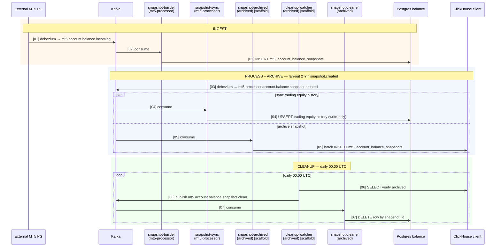

# Balance Pipeline — Sequence Diagram

ดูคู่กับ [flow.csv](flow.csv) — `[XX]` ในข้อความ = step number ใน flow.csv

## Legend

- **[scaffold]** — binary มีอยู่แต่ยังเป็น stub (tick log TODO เฉยๆ) ต้อง implement
- สีกล่อง: ส้ม = INGEST · ฟ้า = PROCESS+ARCHIVE · เขียว = CLEANUP
