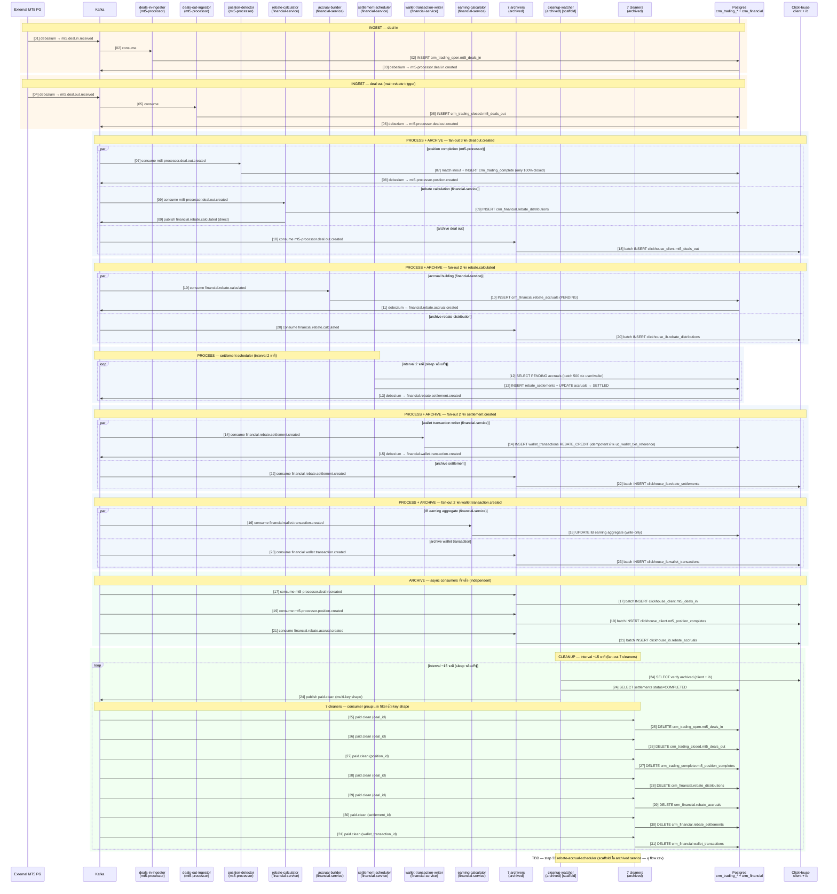

# Deal Pipeline — Sequence Diagram

ดูคู่กับ [flow.csv](flow.csv) — `[XX]` ในข้อความ = step number ใน flow.csv

## Legend

- **[scaffold]** — binary มีอยู่แต่ยังเป็น stub (tick log TODO เฉยๆ) ต้อง implement ให้ทำงานจริง
- **[missing]** — ยังไม่มี binary ตัวนี้ ต้องสร้างใหม่
- สีกล่อง: ส้ม = INGEST · ฟ้า = PROCESS+ARCHIVE · เขียวอ่อน = ARCHIVE-only · เขียว = CLEANUP
- `par/and` block = consumers หลายตัว consume topic เดียวกัน (fan-out)
- `loop` block = cron / interval worker
